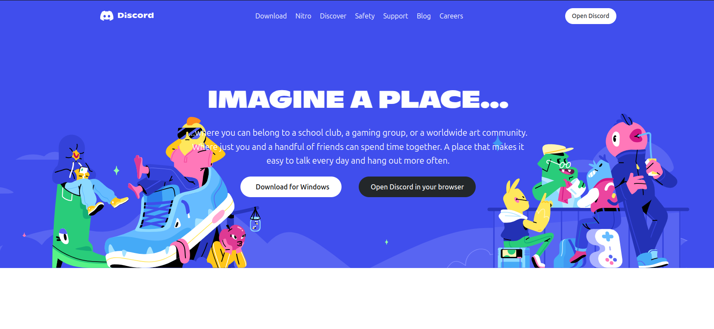
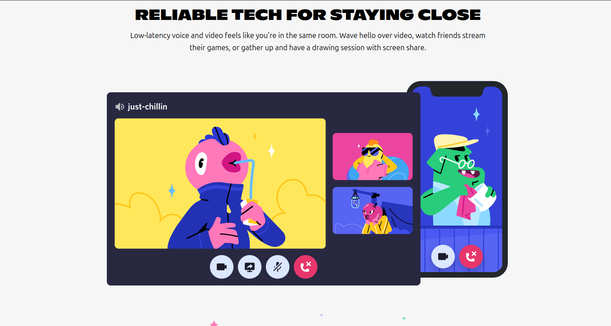
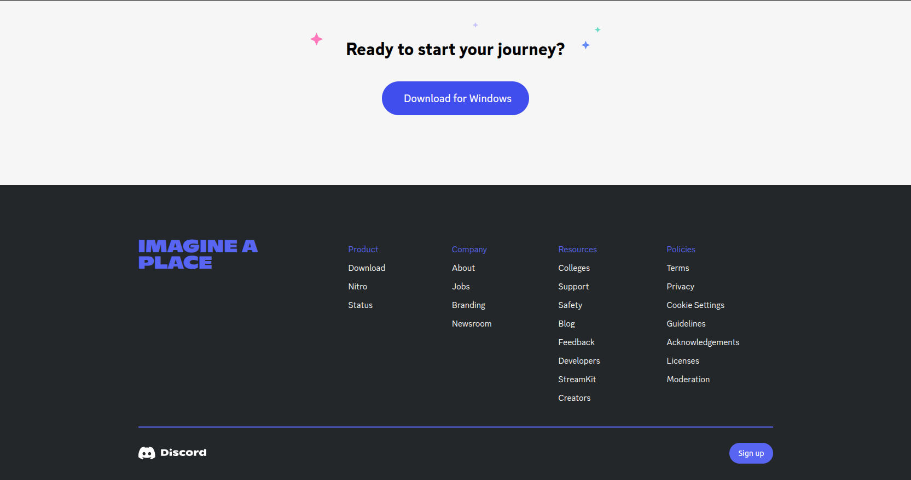

# 🎮 Discord Clone Frontend

### A pixel-perfect Discord UI clone built with HTML and Tailwind CSS ✨

## 🔍 Overview

This project is a frontend-only implementation of Discord's user interface. It replicates the look and feel of Discord using only HTML and Tailwind CSS, without any JavaScript functionality. The project focuses on creating a visually accurate and responsive clone that mimics the Discord desktop application experience.

## 🛠️ Technologies Used

- #### `HTML5`: For structuring the content
- #### `Tailwind CSS`: For styling without writing custom CSS

## 📸 Screenshots

## 🚀 Installation

1. Clone this repository :
> #### git clone https://github.com/mailmeatdarshan/DiscordClone.git

2. Install Tailwind CSS : (NOTE : Older Version - using the commands)

> npm i -D tailwindcss@3 postcss autoprefixer vite

> npx tailwindcss init -p

3. Now run it :
> npm run start

## 🔮 Future Improvements

### Potential enhancements :

- #### ⚡ Add JavaScript functionality for interactive features
- #### 🔐 Implement user authentication
- #### ✍️ Create message input functionality
- #### 🎤 Add voice channel interfaces
- #### 📱 Implement responsive design for mobile devices

## 🙌 Credits

#### This project is inspired by Discord's UI design. It is created for educational purposes to demonstrate HTML and Tailwind CSS skills.
---

Note: This is a frontend clone for educational purposes only and is not affiliated with Discord Inc. 🚀